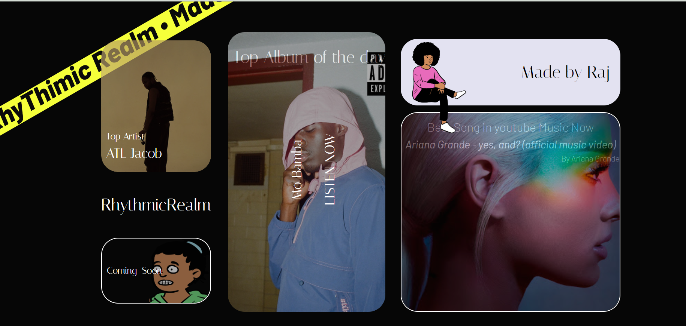
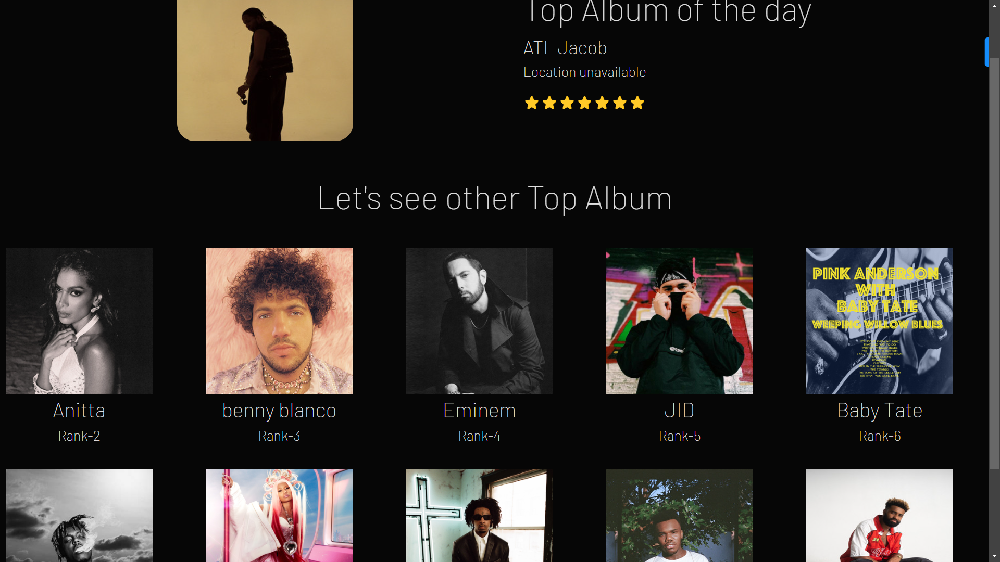
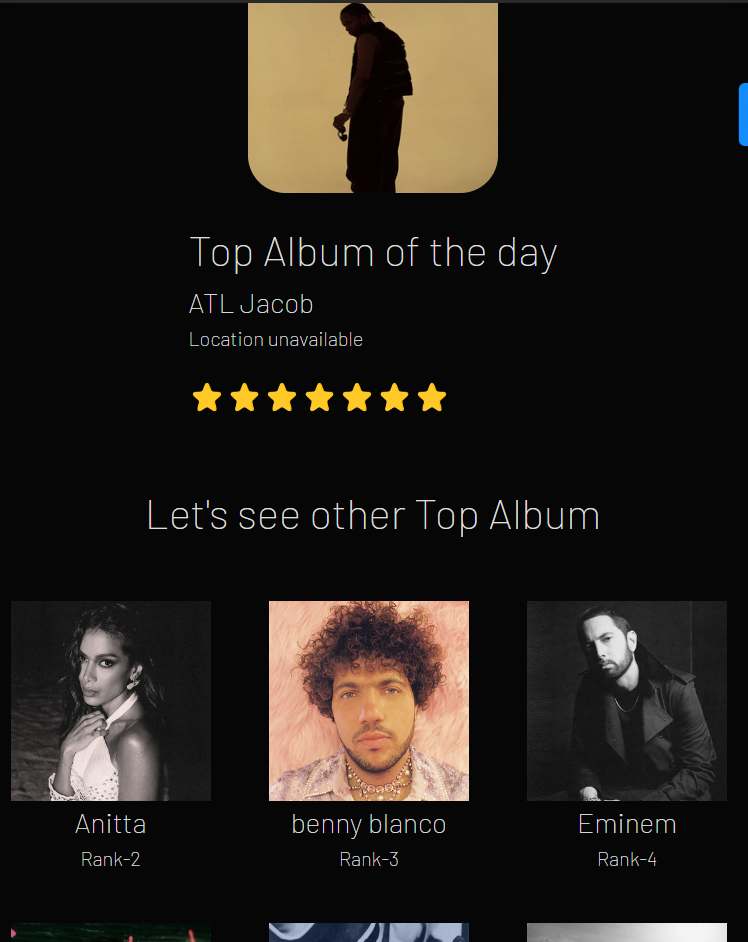

# RhythmicRealm

RhythmicRealm is a React web application that showcases the top music artists and YouTube music videos using data from an external API.

## Features

- Display the top music artists based on data from an external API.
- Showcase the top YouTube music videos based on data from an external API.

## Technologies Used

- React.js
- JavaScript
- HTML
- CSS
- [External API] - (provide link to the API documentation)

## Installation

1. Clone the repository:

`
git clone https://github.com/Axxi3/RhytmicRealm.git`  
Navigate to the project directory:
 
`cd RhythmicRealm` 
 
Install dependencies:
 
`npm install` 
 
Run the app:
 
`npm run dev`

Open http://localhost:5137 to view it in the browser.
<h1>Usage</h1>
Upon launching the application, users will see the top music artists and YouTube music videos displayed on the homepage.
Users can interact with the application to explore more music content.
API Integration
RhythmicRealm utilizes an external API to fetch data about the top music artists and YouTube music videos.
To integrate the API, please follow the instructions provided in the API documentation and update the relevant code files accordingly.
Contributing
Contributions are welcome! Please feel free to submit any bug fixes, feature enhancements, or suggestions via pull requests or by opening an issue.

<h1>Some Screenshots of this site</h1>
<h2>Home screen</h2>

<h2>Top Artist screen</h2>

 

<h2>Responsiveness</h2>

